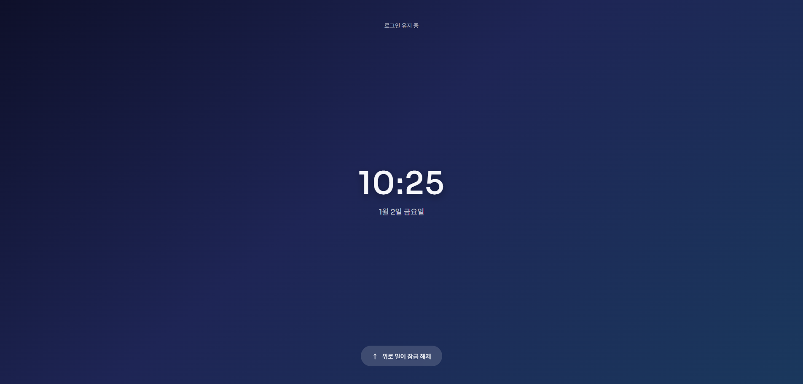
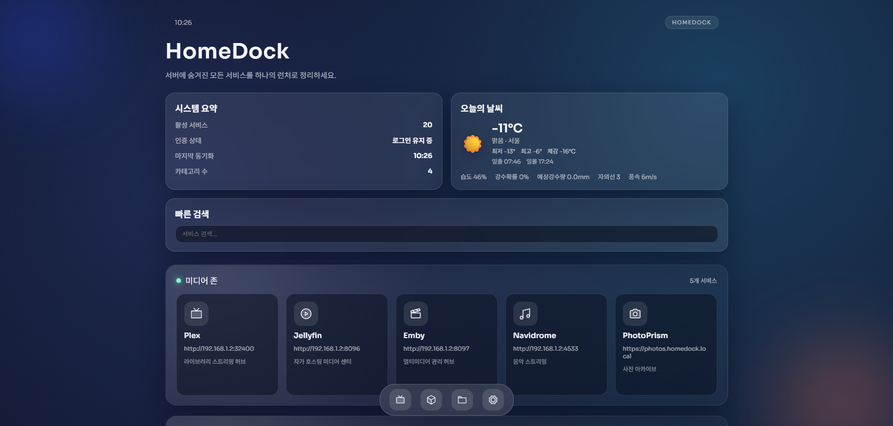
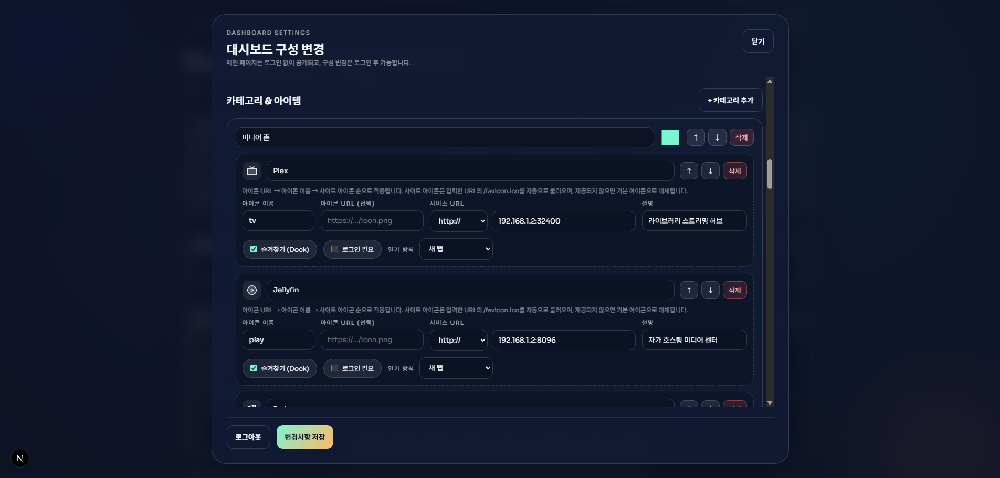

# HomeDock

HomeDock은 서버의 포트와 서브도메인을 세련된 대시보드로 정리하는 런처입니다.
Next.js + NestJS 모노레포 구성이며 SQLite 기반 설정을 사용하고, Linux/ARM 및 Docker Compose 배포를 염두에 두었습니다.

## 주요 기능
- 공개 메인 대시보드 + 관리자 전용 설정 모달
- 카테고리 카드/정사각형 서비스 타일/즐겨찾기 Dock
- 테마 프리셋과 헤더/도크 구분선/레이아웃 표시 토글
- Open-Meteo 날씨 (IP 자동 위치 + 검색 기반 수동 설정)
- 시스템 요약 카드/날씨 하단 정보의 항목·순서 커스터마이징
- 한국어/영어/일본어/중국어 다국어 지원

## 스크린샷





## 요구 사항
- Node.js 20+
- pnpm 9+ (Corepack 사용)
- Docker (선택, Compose 배포용)

## 빠른 시작 (Docker)
1. 저장소를 클론하고 이동합니다.

```bash
git clone https://github.com/BeomSeokYu/HomeDock.git
cd HomeDock
```

2. 환경 파일을 복사합니다.

```bash
cp .env.example .env
```

3. `.env`에서 아래 값을 설정하세요.
   - `ADMIN_EMAIL`, `ADMIN_PASSWORD`, `JWT_SECRET`
   - `WEB_ORIGIN` (CORS 허용 도메인)
   - `NEXT_PUBLIC_API_BASE_URL` (웹 빌드에 포함됨)
   - `NEXT_PUBLIC_SITE_URL` (사이트맵/OG 메타데이터용)
   - 필요 시 `API_PORT`, `WEB_PORT`로 포트 변경

4. 빌드 & 실행:

```bash
docker compose up --build -d
```

5. `http://localhost:3000` 접속

## 로컬 개발
```bash
corepack enable
pnpm install
pnpm db:migrate
pnpm dev
```

필요 시 개별 실행:
```bash
pnpm dev:web
pnpm dev:api
```

기본 포트: 웹 `:3000`, API `:4000`.

## API 엔드포인트
- `POST /api/auth/login` -> 로그인 쿠키 설정 + 사용자 반환
- `POST /api/auth/logout` -> 인증 쿠키 삭제
- `GET /api/auth/me` -> 현재 사용자
- `GET /api/dashboard` -> 공개 대시보드 데이터
- `GET /api/dashboard/admin` -> 관리자 대시보드 데이터 (인증 필요)
- `PUT /api/dashboard/admin` -> 설정/카테고리 업데이트 (인증 필요)
- `GET /api/weather` -> 현재 날씨 + 일간 정보
- `GET /api/weather/locations?query=...` -> 위치 검색

## 참고 사항
- Docker Compose 사용 시 SQLite 파일은 호스트의 `./homedock-data/homedock.db`에 저장됩니다.
- 관리자 계정은 API 부팅 시 `.env` 값으로 동기화됩니다 (이메일/비밀번호 변경 반영).
- API 컨테이너는 `prisma/migrations`가 있으면 시작 시 마이그레이션을 적용합니다.
- `NEXT_PUBLIC_API_BASE_URL`은 웹 빌드에 포함되므로 변경 시 웹 재빌드가 필요합니다.
- 관리자 인증은 HttpOnly 쿠키를 사용합니다(기본 `SameSite=Lax`). 웹과 API가
  다른 도메인이라면 `COOKIE_SAME_SITE=none`, `COOKIE_SECURE=true`로 설정하고
  CSRF 방어를 함께 적용하세요.
- Dynamic OG/icon routes use the Next.js edge runtime; build warnings about edge
  runtime are expected when those routes are enabled.

## 에셋 & 미리보기
파비콘/앱 아이콘/미리보기 이미지는 SVG 템플릿에서 생성합니다.
UI를 업데이트했거나 미리보기 이미지를 갱신하려면 아래 명령을 실행하세요.

```bash
pnpm assets:generate
```

참고: 에셋 생성은 `sharp`를 사용합니다. 환경에 맞는 바이너리가 없으면
Linux/macOS에서 실행하거나 플랫폼에 맞는 빌드를 설치하세요.
